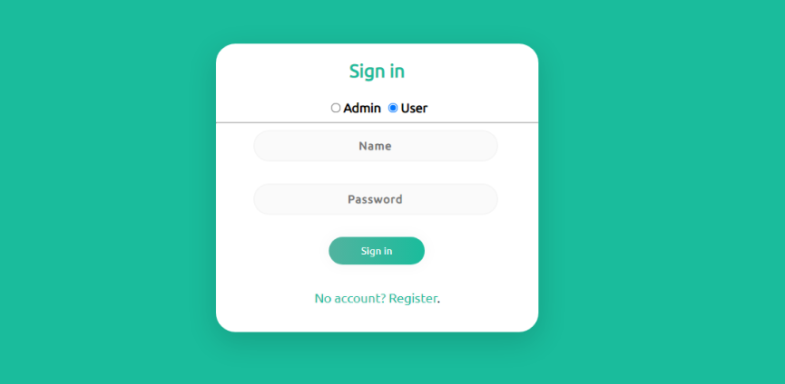
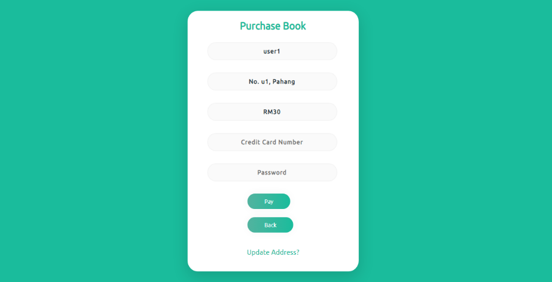
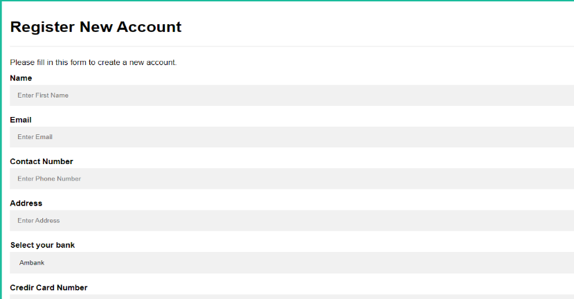
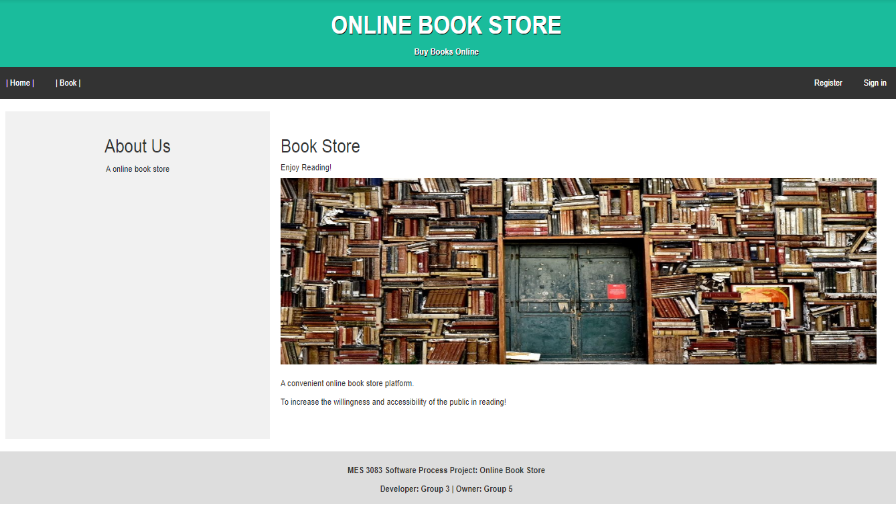
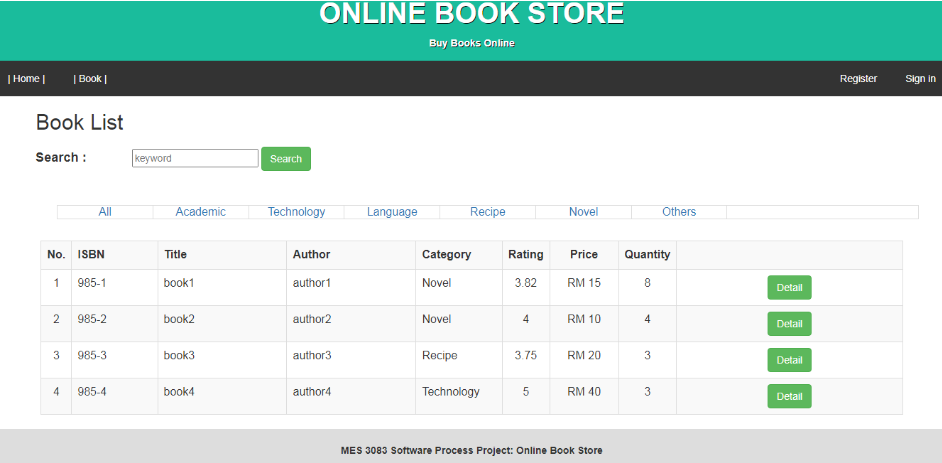

# Online_book_store_MES8
Assignment for MES3083 software process in June 2022, develop follow Staged-delivery Incremental Process Model.

## Requirements

Complete SRS document: <a href='hhh'>Software Requirement Specification</a>

It is a online web application for customers to purchase book online. Overall there are 14 functions in this system:

### **Function List & User Access Constraints:**
| FR_ID         | Functional Requirement | Admin | User| Visitor|
| ------------- |:-------------:|:-----:|:-----:|:-----:|
|   FR001       | Create User Account    |/|/|/|
|   FR002       | Login                  |/|/| |
|   FR003       | Logout                 |/|/| |
|   FR004       | Edit Personal Info     |/|/| |
|   FR005       | Edit Users' Info       |/| | |
|   FR006       | View Book              |/|/|/|
|   FR007       | Search Book            |/|/|/|
|   FR008       | Add Book               |/| | |
|   FR009       | Edit Book              |/| | |
|   FR010       | Delete Book            |/| | |
|   FR011       | Add Book To Cart       | |/| |
|   FR012       | Purchase Book          | |/| |
|   FR013       | Comfirm Order          |/| | |
|   FR014       | Rate Book              | |/| |

### **Detail For Each Functions:**
Whole system can be seperate into 3 subsystems:
1. Manage User
2. Manage Book
3. Manage Order

### 1. Manage User:
1. Create User Account (Register): A function for all users or visitors to establish a user account with the system before they can purchase books in the system.
2. Login: A function where users must provide their login details that they have created during registration.
3. Logout: A function that allow all users leave this system as registered users (become a visitor)
4. Edit Personal Info: A function that allows all login users to edit their details.
5. Edit Users' Info: A function that allows the admin to edit all users’ information.

### 2. Manage Book:
1. View Book: A function for all users and visitors to view all book records in the system.
2. Search Book: A function for all users and visitors to search a book using certain keywords (Author or Book Name).
3. Add Book: A function for the admin to add a new book record into the system.
4. Edit Book: A function for the admin to edit the details for the existence book.
5. Delete Book: A function for the admin to delete the existence book.
6. Rate Book: A function for users to rate a book from 0 to 5 stars.

### 3. Manage Order:
1. Add Book To Cart: A function for users to add books into their own shopping cart.
2. Purchase Book: A function for users to purchase book(s) in their shopping cart.
3. Confirm Order: A function for the admin to confirm the order made by the login users.

Note: Currently there is no 'Delete Order' function. User or Admin unable to delete order once it was create.

## Interface
There are only 4 interface design, multiple functions share a same interface:

### 1. Interface 1
Login and Purchase Book function share the same interface design.

**Login:**

**Purchase Book:**

### 2. Interface 2
Create User Account (Register), Add Book, Edit Book, Delete Book, Add Book To Cart share a similar table interface.

**Create New Account:**

### 3. Interface 3
Home page, View book detail and Rate Book share a similar interface, which include a header to control accessibility of functions for different user classes.

**Home:**

### 4. Interface 4
Interface 4 was used to list books, users and orders and carts. 

**Book List:**

